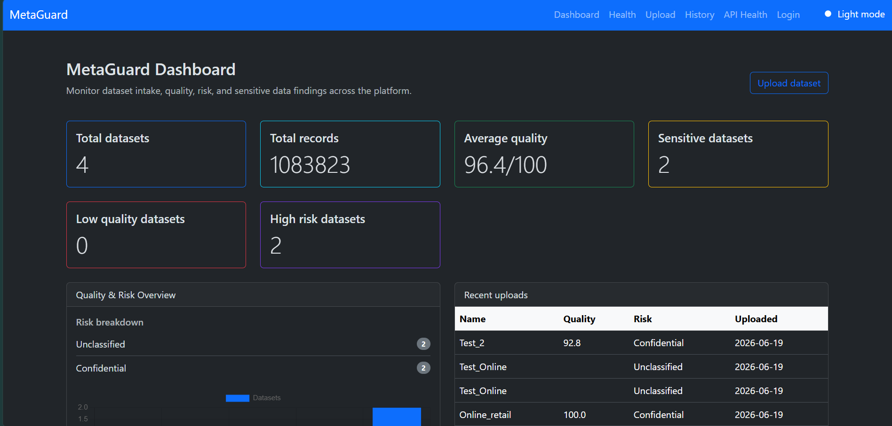
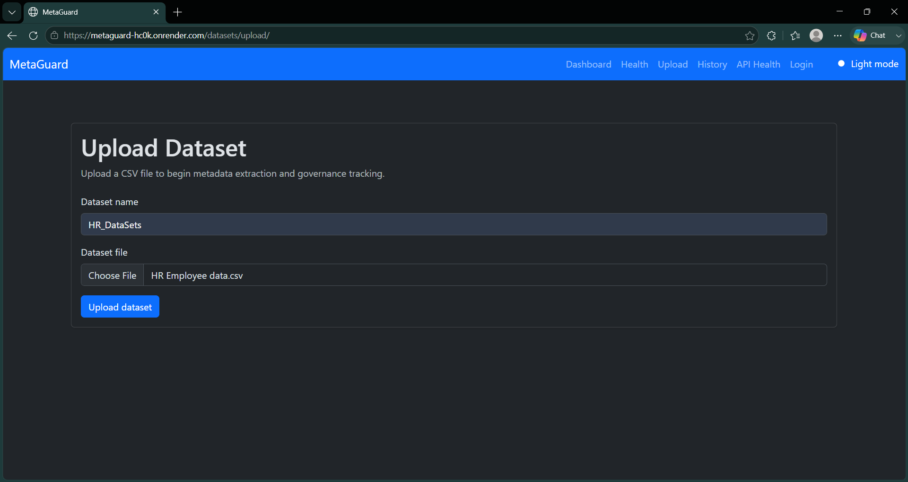
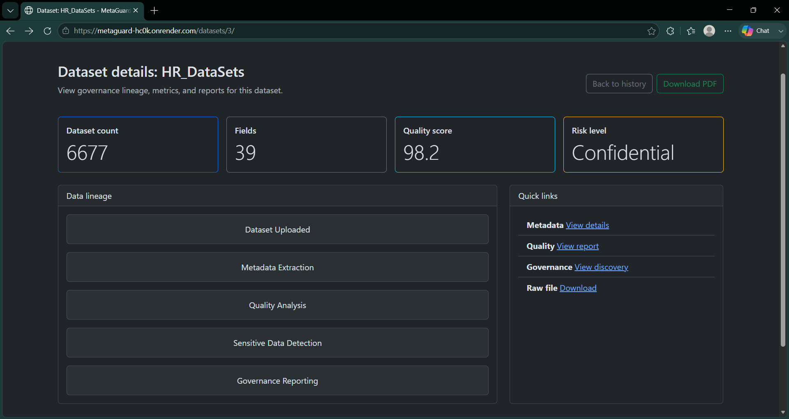
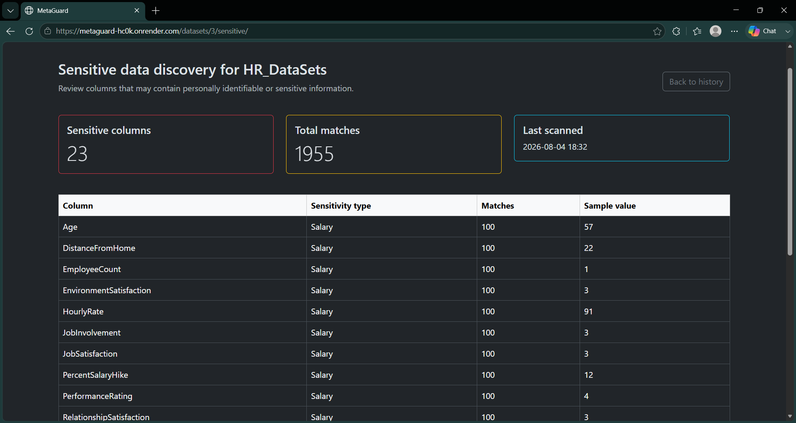

# 🚀 MetaGuard


## Enterprise Data Governance & Risk Intelligence Platform

MetaGuard is a production-ready data governance platform built with Django that helps organizations analyze datasets by extracting metadata, detecting Personally Identifiable Information (PII), evaluating data quality, classifying risk, and generating governance reports.

Designed using modern backend engineering practices, MetaGuard supports asynchronous processing, containerized deployment, automated CI, and cloud deployment.

🌐 **Live Demo:** https://metaguard-hc0k.onrender.com

---

# 📸 Screenshots

> Replace these placeholders with actual screenshots.

### Dashboard



### Dataset Upload



### Data Quality Analysis



### Governance Report



---

# ✨ Features

- 📂 Upload CSV & JSON datasets
- 🔍 Automatic metadata extraction
- 🛡️ PII detection
- 📊 Data quality analysis
- ⚠️ Dataset risk classification
- 📄 Automated governance PDF reports
- ⚡ Background processing with Celery & Redis
- 🐳 Dockerized deployment
- 🚀 CI/CD with GitHub Actions

---

# 🏗️ Architecture

```text
                 Client
                    │
                    ▼
               Gunicorn
                    │
                    ▼
                Django App
          ┌─────────┴─────────┐
          ▼                   ▼
    PostgreSQL             Redis
                                │
                                ▼
                           Celery Worker
```

---

# 🛠️ Tech Stack

| Layer | Technology |
|--------|------------|
| Backend | Django 5 |
| Database | PostgreSQL |
| Background Tasks | Celery |
| Message Broker | Redis |
| Data Processing | Pandas |
| Report Generation | ReportLab |
| Web Server | Gunicorn |
| Containerization | Docker & Docker Compose |
| CI/CD | GitHub Actions |
| Deployment | Render |

---

# ⚙️ Installation

Clone the repository:

```bash
git clone https://github.com/prijithjohn/Metaguard.git

cd Metaguard
```

Create the environment file:

```bash
cp .env.example .env
```

Run with Docker:

```bash
docker compose up --build
```

Application:

```
http://localhost:8001
```

---

# 🔑 Environment Variables

```text
DJANGO_SECRET_KEY
DEBUG
ALLOWED_HOSTS

DB_ENGINE
POSTGRES_DB
POSTGRES_USER
POSTGRES_PASSWORD
POSTGRES_HOST
POSTGRES_PORT

REDIS_URL
CELERY_BROKER_URL
CELERY_RESULT_BACKEND
```

---

# 🚀 Deployment

The application is deployed using:

- Docker
- Render
- PostgreSQL
- Redis
- Gunicorn
- GitHub Actions

Live URL:

https://metaguard-hc0k.onrender.com

---

# 💡 Engineering Skills Demonstrated

- Django Backend Development
- REST API Design
- PostgreSQL
- Celery & Redis
- Docker & Docker Compose
- GitHub Actions (CI)
- Production Deployment
- Pandas Data Processing
- PDF Report Generation
- Enterprise Data Governance

---

# 🚀 Roadmap

- [x] Docker Support
- [x] GitHub Actions CI
- [x] Production Deployment
- [ ] NGINX Reverse Proxy
- [ ] Kubernetes Deployment
- [ ] Terraform
- [ ] Prometheus & Grafana
- [ ] AWS S3 File Storage

---

# 📂 Project Structure

```
MetaGuard/
├── datasets/
├── metaguard_project/
├── quality/
├── reports/
├── scripts/
├── tests/
├── Dockerfile
├── docker-compose.yml
├── entrypoint.sh
├── requirements.txt
└── README.md
```

---

# 👨‍💻 Author

**Prijith John**

- GitHub: https://github.com/prijithjohn
- LinkedIn: [linkedin.com/in/prijith-john-dev](https://www.linkedin.com/in/prijith-john-dev/)
- Portfolio: [prijith-portfolio.vercel.app 
](https://prijith-portfolio.vercel.app/)
---

# ⭐ Support

If you found this project useful, consider giving it a **⭐ Star** on GitHub.

It helps others discover the project and supports future development.
